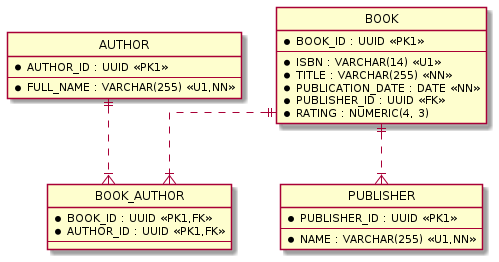

# PostgreSQL Performance Essentials in 1 Hour

* [Run PostgreSQL and pgAdmin](#31bb545671c6f28bf4d0c32e9ff42e10)
* [Create sample schema with data](#46c030b410d17f0142ec5c684020c12b)
* [Query plan](#d3f45a1dbf52313215de2d72335b08c9)
* [Seq Scan](#5077602cb415acf28d7b838fd00c4c86)
* [Index selectivity](#8ab5ea27dde1f77a2a3059f626b52ca5)
* [B-Tree indexes](#a4a9f6a9d3e60a151754f45f91f5978c)
  * [Index Scan](#9e0a689058c255f7dbc8a3303cec18a8)
  * [Bitmap Scans](#0aca2dd64d94c0de22b10b1249f3d461)
* [Multicolumn indexes](#063cd14ca3da4c69df873907b8cd09f2)
  * [Index Only Scan](#0bc6a1f1a4c2655e1ad0f09702ca813d)
* [Unique indexes](#e0b12e6f9f94a86f5c585a73a7824d4a)
* [Partial indexes](#a9961238a26d752aadf86e48184eef90)
* [Expression indexes](#41e31e7b92b335c5f475794040a589a4)
* [GIN indexes](#1d7f7e5f39be8319be61e0509a9e0090)
* [Hash indexes](#c39d79c0c6f99d7ff585ac9408522a22)
* [Create indexes on foreign keys](#9604d17d77116450f47e7f7d7cb37c58)
* [Use more joins](#7fc107be8e1d492f8fc88bec58ff7740)
* [Don't over-index](#76ccb0862b9d9d30188b32c852396b28)
* [Keep statistics updated](#2b1d46eeefdef5de7e4b4d5ce62849c4)
* [Detect slow queries](#8f264ba3b501b66608e02c8c5efc2c58)
* [Cluster a table according to an index](#ae39d16394b02eaba62f114a8d4231b2)
* [Use table partitioning](#88bb68b618474d18c73e4ada7256cfd9)

This example covers the most important topics related to PostgreSQL performance.

## <a name="31bb545671c6f28bf4d0c32e9ff42e10"></a>Run PostgreSQL and pgAdmin

1. Make sure Docker and Docker Compose are installed and up to date

2. Run `docker-compose up -d`, wait for it to initialize completely

3. Login to pgAdmin 4 at `http://localhost:8080` as `admin@example.com/s3cr3t`

4. Connect to `Local PostgreqSQL` as `admin/s3cr3t`

## <a name="46c030b410d17f0142ec5c684020c12b"></a>Create sample schema with data



1. Create schema by executing DDL statements from [`schema.sql`](schema.sql)

2. Create test data by executing DML statements from [`data.sql`](data.sql)

3. Generate more test data
    ```sql
    INSERT INTO book (isbn, title, publication_date, rating)
    SELECT SUBSTR(MD5(RANDOM()::TEXT), 0, 14), 
           MD5(RANDOM()::TEXT), 
           DATE '2010-01-01' + CAST(RANDOM() * (DATE '2020-01-01' - DATE '2010-01-01') AS INT),
           ROUND((1 + RANDOM() * 4)::numeric, 3)
      FROM generate_series(1, 100000);
    ```

---

* https://www.postgresql.org/docs/13/functions-srf.html

## <a name="d3f45a1dbf52313215de2d72335b08c9"></a>Query plan

PostgreSQL has *planner/optimizer* that creates an optimal execution plan.

To understand how to optimize an SQL query we need to know its execution plan.

`EXPLAIN ANALYZE` followed by `SELECT ...`, `UPDATE ...`, or `DELETE ...`, 
executes the statement and provides a query plan with details about the execution.

```sql
EXPLAIN ANALYZE
SELECT * FROM book;
```
```
QUERY PLAN
----------
"Seq Scan on book  (cost=0.00..3667.07 rows=100007 width=89) (actual time=0.003..6.143 rows=100007 loops=1)"
"Planning Time: 0.100 ms"
"Execution Time: 8.622 ms"
```

A query plan shows what type of scanning was used for the query:
* Seq Scan
* Bitmap Index Scan and Bitmap Heap Scan
* Index Scan
* Index Only Scan

To display a query plan as a diagram with an additional information in pgAdmin 4 use `EXPLAIN (ANALYZE, COSTS, VERBOSE, BUFFERS, FORMAT JSON)`.

---

* https://www.postgresql.org/docs/13/planner-optimizer.html
* https://www.postgresql.org/docs/13/sql-explain.html

## <a name="5077602cb415acf28d7b838fd00c4c86"></a>Seq Scan

Seq Scan is a full table scan and always reads everything in the table. 
It scans through every page of data sequentially.

1. Seq Scan is efficient when a large proportion of the table is retrieved from the table
    ```sql
    EXPLAIN ANALYZE
    SELECT b.isbn, 
           b.title,
           b.publication_date,
           b.rating
      FROM book b
    ```
    ```
    QUERY PLAN
    ----------
    "Seq Scan on book b  (cost=0.00..3667.07 rows=100007 width=57) (actual time=0.008..13.369 rows=100007 loops=1)"
    "Planning Time: 0.035 ms"
    "Execution Time: 15.806 ms"
    ```

2. Seq Scan can filter rows while reading them
    ```sql
    EXPLAIN ANALYZE
    SELECT b.isbn, 
           b.title,
           b.publication_date,
           b.rating
      FROM book b
     WHERE b.publication_date = '1994-11-10';
    ```
    ```
    QUERY PLAN
    ----------
    "Seq Scan on book b  (cost=0.00..3917.09 rows=27 width=57) (actual time=0.008..8.575 rows=1 loops=1)"
    "  Filter: (publication_date = '1994-11-10'::date)"
    "  Rows Removed by Filter: 100006"
    "Planning Time: 0.056 ms"
    "Execution Time: 8.592 ms"
    ```

3. When a small number of rows is returned by the query a scan that uses index is more efficient.
    If there in no suitable index for the query, Seq Scan is the only available option.
    
    Create indexes if often less than 15% of the table's rows are going to be retrieved.

4. Reset statistics counters to zeros
    ```sql
    SELECT pg_stat_reset();
    ```

5. Let the system work for some time after resetting statistics.

6. Get the suggestion what tables need an index by looking at `seq_scan` and `seq_tup_read`. These columns show what tables were used in sequential scans
    ```sql
    SELECT schemaname,
           relname as table_name,
           seq_scan, -- Number of sequential scans initiated on this table
           seq_tup_read, -- Number of live rows fetched by sequential scans
           idx_scan, -- Number of index scans initiated on this table
           idx_tup_fetch -- Number of live rows fetched by index scans
      FROM pg_stat_user_tables
     WHERE seq_scan > 0
     ORDER BY seq_tup_read DESC;
    ```

## <a name="8ab5ea27dde1f77a2a3059f626b52ca5"></a>Index selectivity

The number of distinct values in the indexed column divided by the number of records in the table is called a selectivity of an index.

Selectivity is one of factors influencing type of scanning the planner/optimezer will use for a query (Index Scan or Bitmap Index Scan).

1. Calculate the selectivity of the single column indexes you want to create
    ```sql
    SELECT ROUND(COUNT(DISTINCT rating)::NUMERIC / COUNT(*), 2) AS selectivity
      FROM BOOK;
    ```
    ```
    selectivity
    -----------
    0.04
    ```
    ```sql
    SELECT ROUND(COUNT(DISTINCT publication_date)::NUMERIC / count(*), 2) AS selectivity
      FROM BOOK;
    ```
    ```
    selectivity
    -----------
    0.04
    ```
2. The best selectivity is 1. Only unique indexes on NOT NULL columns *guaranteed* to have such selectivity.
    ```sql
    SELECT ROUND(COUNT(DISTINCT isbn)::NUMERIC / COUNT(*), 2) AS idx_selectivity
      FROM BOOK;
    ```
    ```
    selectivity
    -----------
    1
    ```

Prefer indexing columns with selectivity greater than > 0.85.

## <a name="a4a9f6a9d3e60a151754f45f91f5978c"></a>B-Tree indexes

### <a name="9e0a689058c255f7dbc8a3303cec18a8"></a>Index Scan

Index Scan uses an index to find rows matching a predicate.
It finds each row in the index and then reads the actual data from the table.

1. Create a single column B-Tree index
    ```sql
    CREATE INDEX idx_book_title ON book (title);
    ```

2. Execute the query
    ```sql
    EXPLAIN ANALYZE
    SELECT b.isbn, 
           b.title,
           b.publication_date,
           b.rating
      FROM book b
     WHERE b.title = 'Patterns of Enterprise Application Architecture';
    ```
    ```
    QUERY PLAN
    ----------
    "Index Scan using idx_book_title on book b  (cost=0.42..8.44 rows=1 width=57) (actual time=0.195..0.197 rows=1 loops=1)"
    "  Index Cond: ((title)::text = 'Patterns of Enterprise Application Architecture'::text)"
    "Planning Time: 0.340 ms"
    "Execution Time: 0.209 ms"
    ```

3. Index Scan was used because index `idx_book_title` has good selectivity (1).

4. If there is an additional predicate in the query (unindexed columns), the Index Scan can filter rows while reading them, just like a sequential scan
    ```sql
    EXPLAIN ANALYZE
    SELECT b.isbn, 
           b.title,
           b.publication_date,
           b.rating
      FROM book b
     WHERE b.title = 'Patterns of Enterprise Application Architecture'
       AND b.rating > 4.5; --unindexed column
    ```
    ```
    QUERY PLAN
    ----------
    "Index Scan using idx_book_title on book b  (cost=0.42..8.44 rows=1 width=57) (actual time=0.013..0.013 rows=0 loops=1)"
    "  Index Cond: ((title)::text = 'Patterns of Enterprise Application Architecture'::text)"
    "  Filter: (rating > 4.5)"
    "  Rows Removed by Filter: 1"
    "Planning Time: 0.303 ms"
    "Execution Time: 0.026 ms"
    ```

5. Postgres will switch to a Seq Scan instead Index Scan when a large proportion of the table (approximately more than 15% of the table's rows) is retrieved from the table (not selective predicate).
    ```sql
    EXPLAIN ANALYZE
    SELECT b.isbn, 
           b.title,
           b.publication_date,
           b.rating
      FROM book b
     WHERE b.publication_date > '2012-01-01';
    ```
    ```
    QUERY PLAN
    ----------
    "Seq Scan on book b  (cost=0.00..3917.09 rows=80034 width=57) (actual time=0.012..16.944 rows=79900 loops=1)"
    "  Filter: (publication_date > '2012-01-01'::date)"
    "  Rows Removed by Filter: 20107"
    "Planning Time: 0.204 ms"
    "Execution Time: 19.364 ms"
    ```

### <a name="0aca2dd64d94c0de22b10b1249f3d461"></a>Bitmap Scans

If index selectivity is bad (approximately less than < 0.85), 
the planner/optimizer will use Bitmap Scan instead of Index Scan.

Bitmap Scan is in the middle between a Seq Scan and an Index Scan.
It is useful when you need a lot of rows from a table and these rows are located in different pages (blocks).

Bitmap Scans always consists of minimum 2 nodes.
There is Bitmap Index Scan at the bottom and then Bitmap Heap Scan.

1. Create index on  acolumns with bad selectivity
    ```sql
    CREATE INDEX idx_book_pub_date ON book (publication_date);
    ```

2. Execute the query
    ```sql
    EXPLAIN ANALYZE
    SELECT b.isbn, 
           b.title,
           b.publication_date,
           b.rating
      FROM book b
     WHERE b.publication_date > '2019-01-01';
    ```
    ```
    QUERY PLAN
    ----------
    "Bitmap Heap Scan on book b  (cost=116.61..2906.71 rows=9848 width=57) (actual time=1.485..5.062 rows=9869 loops=1)"
    "  Recheck Cond: (publication_date > '2019-01-01'::date)"
    "  Heap Blocks: exact=1334"
    "  ->  Bitmap Index Scan on idx_book_pub_date  (cost=0.00..114.15 rows=9848 width=0) (actual time=1.324..1.326 rows=9869 loops=1)"
    "        Index Cond: (publication_date > '2019-01-01'::date)"
    "Planning Time: 0.409 ms"
    "Execution Time: 5.430 ms"
    ```

3. Bitmap Scan was used because index `idx_book_pub_date` has bad selectivity (0.04) and thus the query returns a lot of rows.

4. Bitmap scans are capable of combining multiple indexes using bitmap AND (&) and OR (|).
    ```sql
    CREATE INDEX idx_book_rating ON book (rating);
    ```
    ```sql
    EXPLAIN ANALYZE
    SELECT b.isbn, 
           b.title,
           b.publication_date,
           b.rating
      FROM book b
     WHERE b.publication_date > '2019-01-01'
       AND b.rating > 4.9;
    ```
    ```
    QUERY PLAN
    ----------
    "Bitmap Heap Scan on book b  (cost=166.48..927.55 rows=256 width=57) (actual time=0.537..0.858 rows=253 loops=1)"
    "  Recheck Cond: ((rating > 4.9) AND (publication_date > '2019-01-01'::date))"
    "  Heap Blocks: exact=232"
    "  ->  BitmapAnd  (cost=166.48..166.48 rows=256 width=0) (actual time=0.515..0.515 rows=0 loops=1)"
    "        ->  Bitmap Index Scan on idx_book_rating  (cost=0.00..51.95 rows=2604 width=0) (actual time=0.194..0.194 rows=2547 loops=1)"
    "              Index Cond: (rating > 4.9)"
    "        ->  Bitmap Index Scan on idx_book_pub_date  (cost=0.00..114.15 rows=9848 width=0) (actual time=0.281..0.281 rows=9869 loops=1)"
    "              Index Cond: (publication_date > '2019-01-01'::date)"
    "Planning Time: 0.074 ms"
    "Execution Time: 0.881 ms"
    ```

## <a name="063cd14ca3da4c69df873907b8cd09f2"></a>Multicolumn indexes

1. Sometimes two or more columns with poor selectivity can be combined to form a multicolumn index with good selectivity
    ```sql
    SELECT ROUND((
      SELECT COUNT(*) AS count_distinct FROM (
        SELECT DISTINCT publication_date, rating FROM book
      ) AS t)::NUMERIC / COUNT(*), 2) AS selectivity
    FROM book;
    ```
    ```
    selectivity
    -----------
    1.00
    ```

2. Drop the single column indexes 
    ```sql
    DROP INDEX idx_book_pub_date, 
               idx_book_rating;
    ```

3. Create a multicolumn index
    ```sql
    CREATE INDEX idx_book_pub_date_rating ON book (publication_date, rating);
    ```

4. Execute the query
    ```sql
    EXPLAIN ANALYZE
    SELECT b.isbn, 
           b.title,
           b.publication_date,
           b.rating
      FROM book b
     WHERE b.publication_date > '2019-01-01'
       AND b.rating > 4.9;
    ```
    ```
    QUERY PLAN
    ----------
    "Bitmap Heap Scan on book b  (cost=254.96..1016.03 rows=256 width=57) (actual time=0.658..0.896 rows=253 loops=1)"
    "  Recheck Cond: ((publication_date > '2019-01-01'::date) AND (rating > 4.9))"
    "  Heap Blocks: exact=232"
    "  ->  Bitmap Index Scan on idx_book_pub_date_rating  (cost=0.00..254.90 rows=256 width=0) (actual time=0.592..0.592 rows=253 loops=1)"
    "        Index Cond: ((publication_date > '2019-01-01'::date) AND (rating > 4.9))"
    "Planning Time: 0.074 ms"
    "Execution Time: 0.922 ms"
    ```

5. The order of predicates in a query is not important. The planner/optimizer will use the index `idx_book_pub_date_rating` for both `WHERE b.publication_date > $1 AND b.rating > $2` and `WHERE b.rating > $2 AND b.publication_date > $1`
    ```sql
    EXPLAIN ANALYZE
    SELECT b.isbn, 
           b.title,
           b.publication_date,
           b.rating
      FROM book b
     WHERE b.rating > 4.9
       AND b.publication_date > '2019-01-01';
    ```
    ```
    QUERY PLAN
    ----------
    "Bitmap Heap Scan on book b  (cost=254.96..1016.03 rows=256 width=57) (actual time=0.732..1.010 rows=253 loops=1)"
    "  Recheck Cond: ((publication_date > '2019-01-01'::date) AND (rating > 4.9))"
    "  Heap Blocks: exact=232"
    "  ->  Bitmap Index Scan on idx_book_pub_date_rating  (cost=0.00..254.90 rows=256 width=0) (actual time=0.694..0.694 rows=253 loops=1)"
    "        Index Cond: ((publication_date > '2019-01-01'::date) AND (rating > 4.9))"
    "Planning Time: 0.102 ms"
    "Execution Time: 1.044 ms"
    ```

6. The multicolumn index will be also used in queries referencing only the left part of the indexed columns in the `WHERE` clause, e.g. `WHERE b.publication_date > $1`
    ```sql
    EXPLAIN ANALYZE
    SELECT b.isbn, 
           b.title,
           b.publication_date,
           b.rating
      FROM book b
     WHERE b.publication_date > '2019-01-01';
    ```
    ```
    QUERY PLAN
    ----------
    "Bitmap Heap Scan on book b  (cost=232.74..3022.84 rows=9848 width=57) (actual time=0.592..4.204 rows=9869 loops=1)"
    "  Recheck Cond: (publication_date > '2019-01-01'::date)"
    "  Heap Blocks: exact=1334"
    "  ->  Bitmap Index Scan on idx_book_pub_date_rating  (cost=0.00..230.28 rows=9848 width=0) (actual time=0.461..0.462 rows=9869 loops=1)"
    "        Index Cond: (publication_date > '2019-01-01'::date)"
    "Planning Time: 0.054 ms"
    "Execution Time: 4.449 ms"
    ```

7. However, the multicolumn index will *not* be used in queries referencing only the right part of the indexed columns in the `WHERE` clause, e.g. `WHERE b.rating > 4`
    ```sql
    EXPLAIN ANALYZE
    SELECT b.isbn, 
           b.title,
           b.publication_date,
           b.rating
      FROM book b
     WHERE b.rating > 4;
    ```
    ```
    QUERY PLAN
    ----------
    "Seq Scan on book b  (cost=0.00..3917.09 rows=24873 width=57) (actual time=0.011..21.136 rows=24998 loops=1)"
    "  Filter: (rating > '4'::numeric)"
    "  Rows Removed by Filter: 75009"
    "Planning Time: 0.118 ms"
    "Execution Time: 21.976 ms"
    ```

8. The multicolumn index will *not* be used in queries where predicates are combined with `OR`
    ```sql
    EXPLAIN ANALYZE
    SELECT b.isbn, 
           b.title,
           b.publication_date,
           b.rating
      FROM book b
     WHERE b.rating > 4.9
        OR b.publication_date > '2019-01-01';
    ```
    ```
    QUERY PLAN
    ----------
    "Seq Scan on book b  (cost=0.00..4167.10 rows=12196 width=57) (actual time=0.752..15.237 rows=12163 loops=1)"
    "  Filter: ((rating > 4.9) OR (publication_date > '2019-01-01'::date))"
    "  Rows Removed by Filter: 87844"
    "Planning Time: 0.067 ms"
    "Execution Time: 15.564 ms"
    ```

### <a name="0bc6a1f1a4c2655e1ad0f09702ca813d"></a>Index Only Scan

[Index Only Scan](https://www.postgresql.org/docs/current/indexes-index-only-scans.html) fetches data directly from the index without reading the table data entirely.

Index Only Scan is the most efficient type of scanning.

To use Index Only Scan the query must select only columns included in the index
```sql
EXPLAIN ANALYZE
SELECT b.publication_date,
       b.rating
  FROM book b
 WHERE b.publication_date = '1994-11-10';
```
```
QUERY PLAN
----------
"Index Only Scan using idx_book_pub_date_rating on book b  (cost=0.42..4.89 rows=27 width=10) (actual time=0.383..0.386 rows=1 loops=1)"
"  Index Cond: (publication_date = '1994-11-10'::date)"
"  Heap Fetches: 0"
"Planning Time: 0.186 ms"
"Execution Time: 0.472 ms"
```

## <a name="e0b12e6f9f94a86f5c585a73a7824d4a"></a>Unique indexes

A unique index guarantees that the table column values won't have duplicates.

Manually unique index can be defined as
```sql
CREATE UNIQUE INDEX book_isbn_key ON book (isbn);
```

PostgreSQL automatically creates a unique index when a unique constraint or primary key is defined for a table.

The column `isbn` of the `book` tables has unique constrained (`isbn VARCHAR(14) UNIQUE`), so the planner/optimezer will use automatically created unique index `book_isbn_key` for the query
```sql
EXPLAIN ANALYZE
SELECT b.isbn, 
       b.title,
       b.publication_date,
       b.rating
  FROM book b
 WHERE b.isbn = '978-1449373320';
```
```
QUERY PLAN
----------
"Index Scan using book_isbn_key on book b  (cost=0.42..8.44 rows=1 width=57) (actual time=0.111..0.111 rows=1 loops=1)"
"  Index Cond: ((isbn)::text = '978-1449373320'::text)"
"Planning Time: 0.063 ms"
"Execution Time: 0.124 ms"
```

---

* https://www.postgresql.org/docs/13/indexes-unique.html

## <a name="a9961238a26d752aadf86e48184eef90"></a>Partial indexes

A partial index is an index with a `WHERE` clause.

Only rows matching the supplied predicated are indexed.
Use partial indexes to exclude rows from an index that are not likely to be queried.

1. Create the partial index
    ```sql
    CREATE INDEX idx_book_pub_date_rating_part on book (publication_date) WHERE rating > 4;
    ```

2. The partial index will be used by queries with predicate `b.rating > 4` like
    ```sql
    EXPLAIN ANALYZE
    SELECT b.isbn, 
           b.title,
           b.publication_date,
           b.rating
      FROM book b
     WHERE b.publication_date > '2019-01-01'
       AND b.rating > 4;
    ```
    ```
    QUERY PLAN
    ----------
    "Bitmap Heap Scan on book b  (cost=35.27..2791.45 rows=2449 width=57) (actual time=0.268..1.500 rows=2436 loops=1)"
    "  Recheck Cond: ((publication_date > '2019-01-01'::date) AND (rating > '4'::numeric))"
    "  Heap Blocks: exact=1130"
    "  ->  Bitmap Index Scan on idx_book_pub_date_rating_part  (cost=0.00..34.66 rows=2449 width=0) (actual time=0.166..0.166 rows=2436 loops=1)"
    "        Index Cond: (publication_date > '2019-01-01'::date)"
    "Planning Time: 0.128 ms"
    "Execution Time: 1.574 ms"
    ```

3. The partial index will *not* be used by queries with predicate `b.rating > $1` and `$1 != 4` like
    ```sql
    EXPLAIN ANALYZE
    SELECT b.isbn, 
           b.title,
           b.publication_date,
           b.rating
      FROM book b
     WHERE b.publication_date > '2019-01-01'
       AND b.rating > 3;
    ```
    ```
    QUERY PLAN
    ----------
    "Bitmap Heap Scan on book b  (cost=115.39..2930.11 rows=4953 width=57) (actual time=0.557..4.687 rows=4979 loops=1)"
    "  Recheck Cond: (publication_date > '2019-01-01'::date)"
    "  Filter: (rating > '3'::numeric)"
    "  Rows Removed by Filter: 4890"
    "  Heap Blocks: exact=1334"
    "  ->  Bitmap Index Scan on idx_book_pub_date  (cost=0.00..114.15 rows=9848 width=0) (actual time=0.410..0.411 rows=9869 loops=1)"
    "        Index Cond: (publication_date > '2019-01-01'::date)"
    "Planning Time: 0.106 ms"
    "Execution Time: 4.857 ms"
    ```

---

* https://www.postgresql.org/docs/13/indexes-partial.html

## <a name="41e31e7b92b335c5f475794040a589a4"></a>Expression indexes

Expression indexes are useful for queries using function in the `WHERE` clause.

1. Sequential scan is used foth the query that match on `LOWER` function (lowercase)
    ```sql
    EXPLAIN ANALYZE
    SELECT b.isbn, 
           b.title,
           b.publication_date,
           b.rating
      FROM book b
     WHERE LOWER(b.title) = 'patterns of enterprise application architecture';
    ```
    ```
    QUERY PLAN
    ----------
    "Seq Scan on book b  (cost=0.00..4167.10 rows=500 width=57) (actual time=0.175..82.824 rows=1 loops=1)"
    "  Filter: (lower((title)::text) = 'patterns of enterprise application architecture'::text)"
    "  Rows Removed by Filter: 100006"
    "Planning Time: 0.128 ms"
    "Execution Time: 82.846 ms"
    ```

2. Create an expression index
    ```sql
    CREATE INDEX idx_book_lower_title on book (LOWER(title));
    ```

3. Repeat the `SELECT` query
    ```
    QUERY PLAN
    ----------
    "Bitmap Heap Scan on book b  (cost=20.29..1290.40 rows=500 width=57) (actual time=0.189..0.190 rows=1 loops=1)"
    "  Recheck Cond: (lower((title)::text) = 'patterns of enterprise application architecture'::text)"
    "  Heap Blocks: exact=1"
    "  ->  Bitmap Index Scan on idx_book_lower_title  (cost=0.00..20.17 rows=500 width=0) (actual time=0.183..0.183 rows=1 loops=1)"
    "        Index Cond: (lower((title)::text) = 'patterns of enterprise application architecture'::text)"
    "Planning Time: 0.526 ms"
    "Execution Time: 0.212 ms"
    ```

---

* https://www.postgresql.org/docs/13/indexes-expressional.html

## <a name="1d7f7e5f39be8319be61e0509a9e0090"></a>GIN indexes

GIN indexes are "inverted indexes".
An inverted index contains a separate entry for each component value, and can efficiently handle queries that test for the presence of specific component values.

1. B-Tree index is not used in queries with `LIKE`
    ```sql
    EXPLAIN ANALYZE
    SELECT b.isbn, 
           b.title,
           b.publication_date,
           b.rating
      FROM book b
     WHERE b.title LIKE 'Patterns%';
    ```
    ```
    QUERY PLAN
    ----------
    "Seq Scan on book b  (cost=0.00..3917.09 rows=10 width=57) (actual time=0.017..18.060 rows=1 loops=1)"
    "  Filter: ((title)::text ~~ 'Patterns%'::text)"
    "  Rows Removed by Filter: 100006"
    "Planning Time: 0.733 ms"
    "Execution Time: 18.096 ms"
    ```

2. To use a trigram GIN indexes, create an extension
    ```sql
    CREATE EXTENSION IF NOT EXISTS pg_trgm;
    ```

3. Create the trigtram GIN index
    ```sql
    CREATE INDEX idx_book_title_trgm ON book USING gin (title gin_trgm_ops);
    ```

4. Repeat the `SELECT` query
    ```
    QUERY PLAN
    ----------
    "Bitmap Heap Scan on book b  (cost=100.08..138.37 rows=10 width=57) (actual time=0.123..0.125 rows=1 loops=1)"
    "  Recheck Cond: ((title)::text ~~ 'Patterns%'::text)"
    "  Rows Removed by Index Recheck: 3"
    "  Heap Blocks: exact=1"
    "  ->  Bitmap Index Scan on idx_book_title_trgm  (cost=0.00..100.08 rows=10 width=0) (actual time=0.112..0.113 rows=4 loops=1)"
    "        Index Cond: ((title)::text ~~ 'Patterns%'::text)"
    "Planning Time: 0.509 ms"
    "Execution Time: 0.167 ms"
    ```

5. GIN index can be combined with other indexes using bitmap operations
    ```sql
    EXPLAIN ANALYZE
    SELECT b.isbn, 
           b.title,
           b.publication_date,
           b.rating
      FROM book b
     WHERE b.publication_date > '2019-01-01'
       AND b.title LIKE 'a%';
    ```
    ```
    QUERY PLAN
    ----------
    "Bitmap Heap Scan on book b  (cost=184.16..1618.23 rows=597 width=57) (actual time=1.916..3.272 rows=621 loops=1)"
    "  Recheck Cond: (((title)::text ~~ 'a%'::text) AND (publication_date > '2019-01-01'::date))"
    "  Heap Blocks: exact=505"
    "  ->  BitmapAnd  (cost=184.16..184.16 rows=597 width=0) (actual time=1.772..1.773 rows=0 loops=1)"
    "        ->  Bitmap Index Scan on idx_book_title_trgm  (cost=0.00..69.46 rows=6061 width=0) (actual time=1.077..1.077 rows=6209 loops=1)"
    "              Index Cond: ((title)::text ~~ 'a%'::text)"
    "        ->  Bitmap Index Scan on idx_book_pub_date  (cost=0.00..114.15 rows=9848 width=0) (actual time=0.599..0.599 rows=9869 loops=1)"
    "              Index Cond: (publication_date > '2019-01-01'::date)"
    "Planning Time: 0.182 ms"
    "Execution Time: 3.334 ms"
    ```

---

* https://www.postgresql.org/docs/13/indexes-types.html

## <a name="c39d79c0c6f99d7ff585ac9408522a22"></a>Hash indexes

Hash index is a flat structure unlike B-Tree.

Hash indexes can only handle simple equality comparisons (using the `=` operator)

The main advantage of Hash indexes over B-Tree is space.
On a very large data sets Hash indexes takes less space compared to B-Tree and allow pretty fast lookups.

Only B-Tree indexes can be unique, hash indexes doesn't support this feature.

To use Hash indexes PostgreSQL 10+ is required.

1. Drop B-Tree index `idx_book_title`
    ```sql
    DROP INDEX idx_book_title
    ```

2. Create Hash index
    ```sql
    CREATE INDEX idx_book_title_hash ON book USING HASH (title);
    ```

3. Execute the query
    ```sql
    EXPLAIN ANALYZE
    SELECT b.isbn, 
           b.title,
           b.publication_date,
           b.rating
      FROM book b
     WHERE b.title = 'Patterns of Enterprise Application Architecture'
    ```
    ```
    QUERY PLAN
    ----------
    "Index Scan using idx_book_title_hash on book b  (cost=0.00..8.02 rows=1 width=57) (actual time=0.029..0.029 rows=1 loops=1)"
    "  Index Cond: ((title)::text = 'Patterns of Enterprise Application Architecture'::text)"
    "Planning Time: 0.122 ms"
    "Execution Time: 0.043 ms"
    ```

## <a name="9604d17d77116450f47e7f7d7cb37c58"></a>Create indexes on foreign keys

Make sure every foreign key has a matching index.

There are few exceptions when index on foreign key is unnecessary:
* if the table with the foreign key is samll because sequential scan will be probably cheaper,
* if you will never join tables on this key,
* if you will never delete a row or update a key column in the referenced table.

1. Execute the query without indexing the foreign keys
    ```sql
    EXPLAIN ANALYZE
    SELECT b.isbn, 
           b.title,
           b.publication_date,
           b.rating
      FROM book b
      JOIN publisher p
        ON p.publisher_id = b.publisher_id
     WHERE b.publication_date = '1994-11-10';
    ```
    ```
    QUERY PLAN
    ----------
    "Hash Join  (cost=5.57..105.83 rows=27 width=57) (actual time=0.753..0.760 rows=1 loops=1)"
    "  Hash Cond: (b.publisher_id = p.publisher_id)"
    "  ->  Bitmap Heap Scan on book b  (cost=4.50..104.69 rows=27 width=73) (actual time=0.456..0.459 rows=1 loops=1)"
    "        Recheck Cond: (publication_date = '1994-11-10'::date)"
    "        Heap Blocks: exact=1"
    "        ->  Bitmap Index Scan on idx_book_pub_date  (cost=0.00..4.50 rows=27 width=0) (actual time=0.436..0.437 rows=1 loops=1)"
    "              Index Cond: (publication_date = '1994-11-10'::date)"
    "  ->  Hash  (cost=1.03..1.03 rows=3 width=16) (actual time=0.124..0.126 rows=3 loops=1)"
    "        Buckets: 1024  Batches: 1  Memory Usage: 9kB"
    "        ->  Seq Scan on publisher p  (cost=0.00..1.03 rows=3 width=16) (actual time=0.114..0.116 rows=3 loops=1)"
    "Planning Time: 1.978 ms"
    "Execution Time: 0.926 ms"
    ```

2. Create the index matching the foreign key
    ```sql
    CREATE INDEX idx_fk_book_publisher ON book (publisher_id);
    ```

3. Repeat the `SELECT` query and compare query plans
    ```
    QUERY PLAN
    ----------
    "Nested Loop  (cost=0.29..26.36 rows=27 width=57) (actual time=0.177..0.193 rows=1 loops=1)"
    "  ->  Seq Scan on publisher p  (cost=0.00..1.03 rows=3 width=16) (actual time=0.008..0.010 rows=3 loops=1)"
    "  ->  Index Scan using idx_fk_book_publisher on book b  (cost=0.29..8.43 rows=1 width=73) (actual time=0.057..0.058 rows=0 loops=3)"
    "        Index Cond: (publisher_id = p.publisher_id)"
    "        Filter: (publication_date = '1994-11-10'::date)"
    "        Rows Removed by Filter: 2"
    "Planning Time: 0.720 ms"
    "Execution Time: 0.226 ms"
    ```

4. Drop the index `idx_fk_book_publisher`
    ```sql
    DROP INDEX idx_fk_book_publisher;
    ```

5. Run the following query to find all unindexed foreign key constraints
    ```sql
    SELECT c.conname AS fk_constraint_name, 
           c.conrelid::REGCLASS AS table, 
           c.confrelid::REGCLASS AS referenced_table,
           ARRAY_AGG(a.attname) AS columns,
           FORMAT('CREATE INDEX ON %s (%s);',
           c.conrelid::regclass,
           STRING_AGG(a.attname, ',')) as sql
      FROM pg_constraint c
      JOIN pg_attribute a 
        ON a.attrelid = c.conrelid 
       AND a.attnum = any(c.conkey)
     WHERE c.contype = 'f'
       AND NOT EXISTS (
           SELECT 1
             FROM pg_index i 
            WHERE i.indrelid = c.conrelid
             AND conkey <@ STRING_TO_ARRAY(indkey::text, ' ')::SMALLINT[])
     GROUP BY c.conname, c.conrelid, c.confrelid;
    ```
    ```
    fk_constraint_name        table   referenced_table  columns           sql
    -------------------------------------------------------------------------
    "book_publisher_id_fkey"  "book"  "publisher"       "{publisher_id}"  "CREATE INDEX ON book (publisher_id);"
    ```
    
  6. Take the values of the `sql` column form the result set and execute to create the missing indexes.

## <a name="7fc107be8e1d492f8fc88bec58ff7740"></a>Use more joins

PostgreSQL is good at joining multiple tables.
Queries with joins are usually better than subqueries.
A query with 5 joins are completely acceptable.

```sql
EXPLAIN ANALYZE
SELECT b.isbn, 
       b.title,
	   b.publication_date,
	   a.full_name,
	   c.name
  FROM book b
  JOIN book_author ba 
    ON b.book_id = ba.book_id
  JOIN author a 
    ON a.author_id = ba.author_id
  JOIN book_category bc 
    ON b.book_id = bc.book_id
  JOIN category c 
    ON c.category_id = bc.category_id
 WHERE b.title LIKE '%Patterns%';
```

## <a name="76ccb0862b9d9d30188b32c852396b28"></a>Don't over-index

Maintaining a lot of indexes has its price.
Indexes consume disk space.
The more indexes you have, the slower `INSERT` statements will become.

Make sure you don't have an unused indexes.

1. Reset statistics counters to zeros
  ```sql
  SELECT pg_stat_reset();
  ```

2. Let the system work for some time after resetting statistics.

3. Find indexes that have never been used
    ```sql
    SELECT s.schemaname,
           s.relname AS table_name,
           s.indexrelname AS index_name,
           s.idx_scan AS times_used,
           pg_size_pretty(pg_relation_size(t.relid)) AS table_size,
           pg_size_pretty(pg_relation_size(s.indexrelid)) AS index_size,
           idx.indexdef AS index_ddl
      FROM pg_stat_user_indexes s
      JOIN pg_stat_user_tables t 
        ON s.relname = t.relname
      JOIN pg_index i
        ON s.indexrelid = i.indexrelid
      JOIN pg_indexes AS idx 
        ON s.indexrelname = idx.indexname
       AND s.schemaname = idx.schemaname
     WHERE s.idx_scan = 0 -- no scans
       AND 0 <> ALL(i.indkey) -- 0 in the array means this is an expression index
       AND NOT i.indisunique -- no unique index
     ORDER BY pg_relation_size(s.indexrelid) DESC;
    ```

## <a name="2b1d46eeefdef5de7e4b4d5ce62849c4"></a>Keep statistics updated

The planner/optimizer relies on statistics about the contents of tables in order to generate good plans for queries.

Make sure to run `VACUUM ANALYZE` to keep statistics up to date and recover or reuse disk space occupied by updated or deleted rows.

PostgreSQL has *autovacuum* daemon automating the execution of `VACUUM` and `ANALYZE` commands.
It is highly recommended to enable autovacuum feature.

Check when the tables was last vacuumed and analyzed
```sql
SELECT schemaname, 
       relname, 
       last_vacuum, 
       vacuum_count, 
       last_analyze, 
       analyze_count 
  FROM pg_stat_user_tables;
```

---

* https://www.postgresql.org/docs/13/routine-vacuuming.html

## <a name="8f264ba3b501b66608e02c8c5efc2c58"></a>Detect slow queries

To detect slow queries `pg_stat_statements` extension is required.
It has to be preloaded using `shared_preload_libraries=pg_stat_statements`.

1. Check that `pg_stat_statements` was preloaded
    ```sql
    SHOW shared_preload_libraries;
    ```
    ```
    shared_preload_libraries
    ------------------------
    "pg_stat_statements"
    ```

2. Create extension for tracking planning and execution statistics of all executed SQL statements
    ```sql
    CREATE EXTENSION IF NOT EXISTS pg_stat_statements;
    ```

3. Get 20 slowest SQL queries
    ```sql
    SELECT SUBSTRING(query, 1, 40) AS short_query,
           ROUND(( 100 * total_exec_time / SUM(total_exec_time) OVER ())::NUMERIC, 2) AS percent,
           ROUND(total_exec_time::numeric, 2) AS total_exec_time,
           calls,
           ROUND(mean_exec_time::numeric, 2) AS mean,
           query
      FROM pg_stat_statements
  ORDER BY total_exec_time DESC
     LIMIT 20;
    ```

---

* https://www.postgresql.org/docs/13/runtime-config-client.html#RUNTIME-CONFIG-CLIENT-PRELOAD

## <a name="ae39d16394b02eaba62f114a8d4231b2"></a>Cluster a table according to an index

When a table is clustered, it is physically reordered based on the index information.

PostgreSQL Documentation:

> In cases where you are accessing single rows randomly within a table, the actual order of the data in the table is unimportant. However, if you tend to access some data more than others, and there is an index that groups them together, you will benefit from using CLUSTER. If you are requesting a range of indexed values from a table, or a single indexed value that has multiple rows that match, CLUSTER will help because once the index identifies the table page for the first row that matches, all other rows that match are probably already on the same table page, and so you save disk accesses and speed up the query.

A table can be clustered according to an index using
```sql
CLUSTER book USING book_isbn_key;
```

Clustering is a one-time operation: when the table is subsequently updated, the changes are not clustered.

---

* https://www.postgresql.org/docs/13/sql-cluster.html

## <a name="88bb68b618474d18c73e4ada7256cfd9"></a>Use table partitioning

Partitioning refers to splitting what is logically one large table into smaller physical pieces.

Partitioning benefits:

* Partitioning helps to scale PostgreSQL by splitting large logical tables into smaller physical tables that can be stored on different storage media based on uses;

* Dividing a large table into smaller tables reduces table scans and memory swap problems and thus increases performance;

* Partitioning reduces index size and makes it more likely that the heavily-used parts of the indexes fit in memory.

You will get benefits from partitioning only when a table is very large.
Very large means that the table is at least larger than the physical memory of the database server.

To use declarative partition PostgreSQL 10+ is required.

1. Make sure *partition pruning* is enabled. Partition pruning is a query optimization technique that improves performance for declaratively partitioned tables.
    ```sql
    SHOW enable_partition_pruning;
    ```
    ```
    enable_partition_pruning
    ------------------------
    on
    ```

2. Drop all tables by executing DDL statements from [`drop-all.sql`](drop-all.sql)

3. Create a table `book` that will be partitioned by `publication_date` column
    ```sql
    CREATE EXTENSION IF NOT EXISTS "uuid-ossp";

    CREATE TABLE book (
        book_id UUID DEFAULT uuid_generate_v4(),
        isbn VARCHAR(14),
        title VARCHAR(255) NOT NULL,
        publication_date DATE NOT NULL,
        rating NUMERIC(4, 3),
        PRIMARY KEY (book_id, publication_date),
        UNIQUE (isbn, publication_date)
    ) PARTITION BY RANGE (publication_date);
    ```

4. Notice: primary key and unique constraint on partitioned table must include all partitioning columns.

5. Create a tablespace for the partition with the most recent data. 
    Tablespace allows to define locations in the file system where the files representing database objects can be stored. 
    This way partitions can be stored on different storage media.
    ```sql
    CREATE TABLESPACE fasttablespace LOCATION '/ssd1/postgresql/data/fasttablespace';
    ```

6. Create partitions for the data from the past in the default tablespace
    ```sql
    CREATE TABLE book_y1990 PARTITION OF book
      FOR VALUES FROM ('1990-01-01') TO ('2000-01-01');

    CREATE TABLE book_y2000 PARTITION OF book
      FOR VALUES FROM ('2000-01-01') TO ('2010-01-01');

    CREATE TABLE book_y2010 PARTITION OF book
      FOR VALUES FROM ('2010-01-01') TO ('2020-01-01');
    ```

7. Create partition for the most recent data in the `fasttablespace` tablespace located on different storage media
    ```sql
    CREATE TABLE book_y2020 PARTITION OF book
      FOR VALUES FROM ('2020-01-01') TO ('2030-01-01')
      TABLESPACE fasttablespace;
    ```

8. Create an index on the key column. This automatically creates one index on each partition.
    ```sql
    CREATE INDEX idx_book_part_key ON book (publication_date);
    ```

9. Generate some test data
    ```sql
    INSERT INTO book (isbn, title, publication_date, rating)
    SELECT SUBSTR(MD5(RANDOM()::TEXT), 0, 14), 
           MD5(RANDOM()::TEXT), 
           DATE '2010-01-01' + CAST(RANDOM() * (DATE '2021-01-01' - DATE '2010-01-01') AS INT),
           ROUND((1 + RANDOM() * 4)::numeric, 3)
      FROM generate_series(1, 100000);
    ```

10. Depending on a predicate, only a single partition (smaller index) can be queried, improving query performance
    ```sql
    EXPLAIN ANALYZE
    SELECT EXTRACT(YEAR FROM b.publication_date) AS pub_year,
           COUNT(*)
      FROM book b
     WHERE b.publication_date > '2020-01-01' -- Only book_y2020 will be queried
     GROUP BY pub_year;
    ```
    ```
    QUERY PLAN
    ----------
    "HashAggregate  (cost=294.23..297.23 rows=200 width=16) (actual time=4.898..4.900 rows=2 loops=1)"
    "  Group Key: date_part('year'::text, (b.publication_date)::timestamp without time zone)"
    "  Batches: 1  Memory Usage: 40kB"
    "  ->  Index Only Scan using book_y2020_publication_date_idx on book_y2020 b  (cost=0.29..248.79 rows=9089 width=8) (actual time=0.021..2.606 rows=9092 loops=1)"
    "        Index Cond: (publication_date > '2020-01-01'::date)"
    "        Heap Fetches: 0"
    "Planning Time: 0.346 ms"
    "Execution Time: 5.112 ms"
    ```

11. Depending on a predicate a, multiple partitions can be queried in parallel and combined into a single result set
    ```sql
    EXPLAIN ANALYZE
    SELECT EXTRACT(YEAR FROM b.publication_date) AS pub_year,
           COUNT(*)
      FROM book b
     WHERE b.publication_date > '2010-01-01' -- Both book_y2010 and book_y2020 will be queried
     GROUP BY pub_year;
    ```
    ```
    QUERY PLAN
    ----------
    "Finalize GroupAggregate  (cost=3455.77..3507.44 rows=200 width=16) (actual time=20.181..21.293 rows=12 loops=1)"
    "  Group Key: (date_part('year'::text, (b.publication_date)::timestamp without time zone))"
    "  ->  Gather Merge  (cost=3455.77..3502.44 rows=400 width=16) (actual time=20.174..21.282 rows=33 loops=1)"
    "        Workers Planned: 2"
    "        Workers Launched: 2"
    "        ->  Sort  (cost=2455.75..2456.25 rows=200 width=16) (actual time=17.239..17.241 rows=11 loops=3)"
    "              Sort Key: (date_part('year'::text, (b.publication_date)::timestamp without time zone))"
    "              Sort Method: quicksort  Memory: 25kB"
    "              Worker 0:  Sort Method: quicksort  Memory: 25kB"
    "              Worker 1:  Sort Method: quicksort  Memory: 25kB"
    "              ->  Partial HashAggregate  (cost=2445.11..2448.11 rows=200 width=16) (actual time=17.210..17.213 rows=11 loops=3)"
    "                    Group Key: (date_part('year'::text, (b.publication_date)::timestamp without time zone))"
    "                    Batches: 1  Memory Usage: 40kB"
    "                    Worker 0:  Batches: 1  Memory Usage: 40kB"
    "                    Worker 1:  Batches: 1  Memory Usage: 40kB"
    "                    ->  Parallel Append  (cost=0.29..2236.82 rows=41657 width=8) (actual time=0.031..10.669 rows=33327 loops=3)"
    "                          ->  Parallel Index Only Scan using book_y2010_publication_date_idx on book_y2010 b_1  (cost=0.29..1835.51 rows=53449 width=8) (actual time=0.024..7.661 rows=30290 loops=3)"
    "                                Index Cond: (publication_date > '2010-01-01'::date)"
    "                                Heap Fetches: 0"
    "                          ->  Parallel Index Only Scan using book_y2020_publication_date_idx on book_y2020 b_2  (cost=0.29..193.03 rows=5360 width=8) (actual time=0.027..1.176 rows=4556 loops=2)"
    "                                Index Cond: (publication_date > '2010-01-01'::date)"
    "                                Heap Fetches: 0"
    "Planning Time: 0.173 ms"
    "Execution Time: 21.418 ms"
    ```

---

* https://www.postgresql.org/docs/13/ddl-partitioning.html
